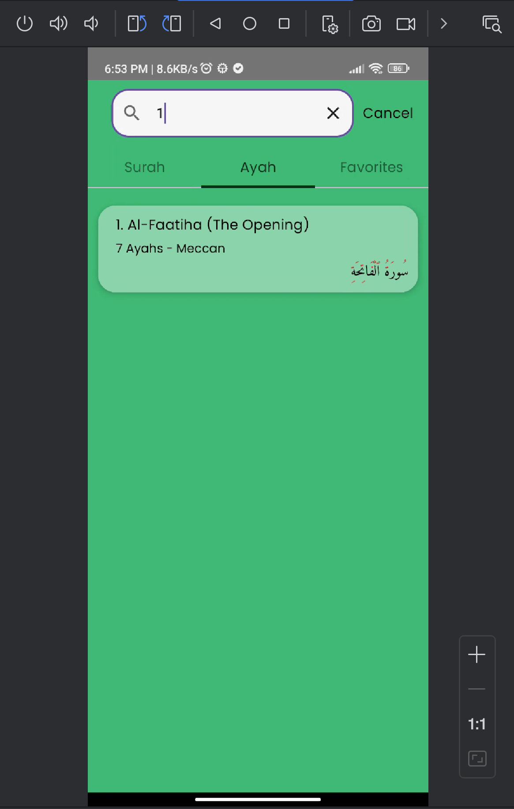

This is a Kotlin Multiplatform project targeting Android, iOS, Desktop.

# Quranic Path

## Features
Quranic Path is an app intended to help people to read Quran online or offline on their phone. The app allows you to read all surahs, search a specific surah or ayah by surah or ayah number. You can read Quran for free here!
This works both online and offline. If you wanna read surah offline then you need to add that surah in favorite

## Screenshots

## Architecture
This app follows the MVI(Model-View-Intent) architecture design pattern.

## Data Source
All data comes from the Quran API
https://alquran.cloud/api

## Set up the environment

> **Warning**
> You need a Mac with macOS to run all the platforms apps on android emulator, ios simulator or real devices.
> This is an Apple requirement.

To work with this template, you need the following:

* A machine running a recent version of macOS
* [Android Studio](https://developer.android.com/studio)
* The [Kotlin Multiplatform Mobile plugin](https://plugins.jetbrains.com/plugin/14936-kotlin-multiplatform-mobile)
* [Xcode](https://apps.apple.com/us/app/xcode/id497799835)

### On Android

To run your application on an Android emulator or real device:

1. Ensure you have an Android virtual device available. Otherwise, [create one](https://developer.android.com/studio/run/managing-avds#createavd). or add real device usb or wireless debugging.
2. At top in the list of run configurations, select `composeApp`.
3. Select Device from top and click **Run**:

  
Alternatively, use Gradle

To install an Android application on a real Android device or an emulator, run `./gradlew installDebug` in the terminal.

### On iOS

#### Running on a simulator

To run your application on an iOS simulator in Android Studio, modify the `iosApp` run configuration:

1. In the list of run configurations, select **Edit Configurations**:
2. Navigate to **iOS Application** | **iosApp**.
3. In the **Execution target** list, select your target device. Click **OK**:
4. The `iosApp` run configuration is now available. Click **Run** next to your virtual device:

#### Running on a real device

You can run your Compose Multiplatform application on a real iOS device for free.
To do so, you'll need the following:

* The `TEAM_ID` associated with your [Apple ID](https://support.apple.com/en-us/HT204316)
* The iOS device registered in Xcode

distributed under the License is distributed on an "AS IS" BASIS,
WITHOUT WARRANTIES OR CONDITIONS OF ANY KIND, either express or implied.
See the License for the specific language governing permissions and
limitations under the License.

### On Desktop

To run your application on desktop:
1. At first go to the main.kt file inside the desktopMain, because that is the desktop entry point.
2. Then run the app by clicking the play button on the right side of the main function. It gives you an error but you do that. 
3. At top in the list of run configurations, select `MainKt` and run the app.